# OutOfOffice AI — Interactive Demo & Video Walkthrough Guide 🌳

> **Hacktoberfest 2026: "Touch Grass" Autonomous Coding Agent**  
> *Give your code a job. Go touch grass.*

---

## 🎬 1. Core End-to-End Walkthrough Flow

The core design philosophy of **OutOfOffice AI** is **asynchronous, local-first developer freedom**. Developers set an autonomous refactoring directive, close their laptop or lock their screen, step outside into nature, and return to an executive audio debrief and verified green code diffs.

```mermaid
sequenceDiagram
    autonumber
    actor Dev as Developer (Offline / Touching Grass 🌳)
    participant UI as React 18 Frontend (Mission Control)
    participant API as FastAPI Orchestrator & WS
    participant Worker as Background LangGraph Runner
    participant LLM as Google Gemma 2 (Local Ollama)
    participant Tools as AST & Test Harness (Git / pytest)
    participant Sentry as Sentry Telemetry
    participant Audio as ElevenLabs Voice Engine

    Dev->>UI: 1. Selects Repo & Directive ("[ 🌳 GO TOUCH GRASS ]")
    UI->>API: POST /api/jobs (repoPath, prompt, mode="FIX")
    API->>Worker: Spawn background asynchronous worker thread
    API-->>UI: Return job_id + redirect to Headless Away Screen
    Dev->>UI: 2. Closes browser tab / locks computer & steps outside
    
    rect rgb(20, 35, 25)
        Note over Worker,Tools: 3. Headless Autonomous Execution (User Away)
        Worker->>Tools: Discover repo & build AST symbol table
        Worker->>Sentry: Start span (ai.agent, ai.tool.call)
        Worker->>LLM: Inquire root-cause plan (Structured JSON)
        LLM-->>Worker: Execution Plan (AST target symbols)
        Worker->>Tools: Create isolated branch 'agent/outofoffice-*'
        Worker->>Tools: Apply surgical patch & run test runner
        Tools-->>Worker: Tests verified green (100% pass)
        Worker->>Audio: Synthesize ElevenLabs voice debrief MP3
        Worker->>API: Commit final report & health metrics to SQLite
    end

    Dev->>UI: 4. Returns 25 minutes later & reopens browser
    UI->>API: GET /api/jobs/{id}/rehydrate
    API-->>UI: Full 5-step timeline, findings, diffs & audio stream
    UI->>Dev: 5. Plays ElevenLabs audio debrief & displays unified diff
```



---

## 🖥️ 2. Screen-by-Screen UI Tour

### Screen 1: Mission Control Dashboard (`/`)
* **Repository Validation**: Real-time inspection of local directories with Git branch detection, language badges, and test suite discovery.
* **One-Click Task Presets**:
  * 🧹 *Find Dead Code & Prune*
  * 🧪 *Fix Failing Tests*
  * 🛡️ *Full Repository Audit*
  * ⚡ *Modernize & Optimize*
* **Mode Toggle**:
  * `🛡️ Audit Mode` (Read-only safe scan, zero file mutations)
  * `⚡ Fix Mode` (Creates `agent/outofoffice-*` branch, writes AST patches, verifies tests)
* **Pulsing CTA**: `[ 🌳 GO TOUCH GRASS ]` vibrant neon green button.

```
+-------------------------------------------------------------------------------+
|  🌳 OutOfOffice AI        [Dashboard]  [Away]  [Trace]  [Results]  (Ollama: gemma2) |
+-------------------------------------------------------------------------------+
|                                                                               |
|  Target Repository: [ c:\Users\samar\Desktop\projects\sample_repo   ] [Validate] |
|  ✓ Valid Git Repo (main) • 114 files • TypeScript, Python • pytest detected   |
|                                                                               |
|  Task Directive Presets:                                                      |
|  +------------------------------+  +---------------------------------------+  |
|  | 🧹 Find Dead Code & Prune     |  | 🧪 Fix Failing Tests (AST Patch)      |  |
|  +------------------------------+  +---------------------------------------+  |
|                                                                               |
|  Mode: [ 🛡️ Audit Mode ]  [ ⚡ Fix Mode ]                                       |
|                                                                               |
|                   +---------------------------------------+                   |
|                   |         [ 🌳 GO TOUCH GRASS ]          |                   |
|                   +---------------------------------------+                   |
|                   ✓ Safe to close browser once dispatched                     |
+-------------------------------------------------------------------------------+
```

---

### Screen 2: Headless Away Screen & Grass Timer (`/away`)
* **Live Digital Timer**: Real-time elapsed duration clock counting screen freedom in `HH:MM:SS`.
* **Outdoor Tier Badges**:
  * 🌱 **Sprout Explorer** (<5 min)
  * 🌿 **Meadow Stroller** (5–15 min)
  * 🌳 **Park Ranger** (15–30 min)
  * 🏔️ **Mountain Monk** (>30 min)
* **Ambient Nature Ambience**: Interactive soothing audio toggle and particle glow.
* **Safe-to-Close Banner**: Reassures the developer that the local process runs decoupled from browser tabs.

```
+-------------------------------------------------------------------------------+
|  🛡️ Local Background Agent Active • Safe to close or lock screen               |
|                                                                               |
|                                     🌳                                        |
|                          Outdoor Level: Park Ranger                           |
|                                                                               |
|                                 00:24:18                                      |
|            "Full deep outdoor immersion. Tests verified green."                |
|                                                                               |
|               [ 2,400 Estimated Steps ]     [ 24 Mins Saved ]                 |
|                                                                               |
|  Status: Agent is running static analysis on AST nodes...                     |
|                                                                               |
|              +-------------------------------------------------+              |
|              |      [ I'm Back! Check Results & Voice Debrief ]|              |
|              +-------------------------------------------------+              |
+-------------------------------------------------------------------------------+
```

---

### Screen 3: Live Agent Trace & Telemetry Visualizer (`/trace`)
* **Chronological Step Timeline**: Step name, tool invoked, execution status (`SUCCESS`, `RUNNING`, `FAILED`), and latency.
* **Expandable Terminal Drawers**: Full stdout & stderr logs with 1-click clipboard copy.
* **Sentry Distributed Waterfall Profiler**: Gantt duration bars for `ai.agent`, `ai.tool.call`, and `ai.model.inference`.
* **KPI Metrics**: Total latency, local model inferences, tool executions, and findings count.

```
+-------------------------------------------------------------------------------+
|  Latency: 4.82s  |  LLM Inferences: 3 (Gemma 2)  |  Tools: 5  |  Findings: 2  |
+-------------------------------------------------------------------------------+
|  [ Step Timeline ]    [ Sentry Waterfall ]    [ AST Findings ]                |
|                                                                               |
|  #1 ✓ AST Discovery & File Indexing          repo_discovery             340ms |
|  #2 ✓ Cross-Reference Symbol Search          search_engine              820ms |
|  #3 ✓ Test Suite Execution                   test_runner               1450ms |
|  #4 ✓ Surgical AST Patch Synthesis           patcher                    410ms |
|  #5 ✓ Post-Fix Green Verification            test_runner               1210ms |
|                                                                               |
|  [+] Terminal Execution Drawer (Step #4):                                     |
|  +-------------------------------------------------------------------------+  |
|  | STDOUT: Applied surgical patch to app/calculator.py: line 8             |  |
|  | Synthesized unified diff: - return a + b / + return a - b               |  |
|  +-------------------------------------------------------------------------+  |
+-------------------------------------------------------------------------------+
```

---

### Screen 4: Results Hub, Unified Diff Viewer & Audio Player (`/results`)
* **ElevenLabs Welcome-Back Audio Player**: Visual waveform progress bar, instant audio streaming, and voice transcript drawer.
* **Radial Health Score Gauge**: Circular progress ring showing overall codebase score (`95/100`).
* **Test Verification Badge**: Pass/Fail proof on isolated branch.
* **Syntax-Highlighted Unified Diff Viewer**: Multi-file patch tabs with emerald green additions (`+`) and rose red removals (`-`).
* **DEV.to 1-Click Export**: Generates markdown post formatted with `#hacktoberfest` tags.

```
+-------------------------------------------------------------------------------+
|  🔊 Welcome-Back Voice Debrief (ElevenLabs)                                   |
|  [▶ Play Debrief]  0:00 ========================= 0:18                        |
|  "Welcome back! While you touched grass for 24 minutes, OutOfOffice AI        |
|   analyzed 114 files, resolved 2 failing tests, and your build is 100% green."|
+-------------------------------------------------------------------------------+
|  [ Health Score: 95/100 ]   [ Tests: 14/14 Green ]   [ Grass: 24 mins away ]  |
+-------------------------------------------------------------------------------+
|  Unified Code Diffs (app/calculator.py):             [ Merge ]  [ Discard ]    |
|  @@ -8,3 +8,3 @@                                                              |
|   def subtract(a: int, b: int) -> int:                                        |
|  -    return a + b                                                            |
|  +    return a - b                                                            |
+-------------------------------------------------------------------------------+
```

---

## 🚀 3. Quickstart & Local Reproduction Instructions

### Prerequisites
- **Python**: 3.10+
- **Node.js**: 18+ (Node 20 or 22 recommended)
- **Ollama**: Local Ollama daemon running `ollama run gemma2:9b` (or falls back to mock inference)
- **ElevenLabs API Key** *(Optional)*: Set `ELEVENLABS_API_KEY` in `.env` or automatic Web Speech fallback is used.
- **Sentry DSN** *(Optional)*: Set `SENTRY_DSN` in `.env` or local in-memory tracer is used.

### Backend Setup
```bash
# 1. Install dependencies
pip install -r requirements.txt

# 2. Run backend API & background worker
uvicorn backend.app.main:app --host 127.0.0.1 --port 8000 --reload
```

### Frontend Setup
```bash
# 1. Navigate to frontend
cd frontend

# 2. Install dependencies & launch Vite dev server
npm install
npm run dev
# Opens http://localhost:5173
```

### Running Automated Test Suites
```bash
# Run all 77 backend unit, E2E, and headless recovery tests
python -m pytest

# Run frontend production build
cd frontend && npm run build
```
